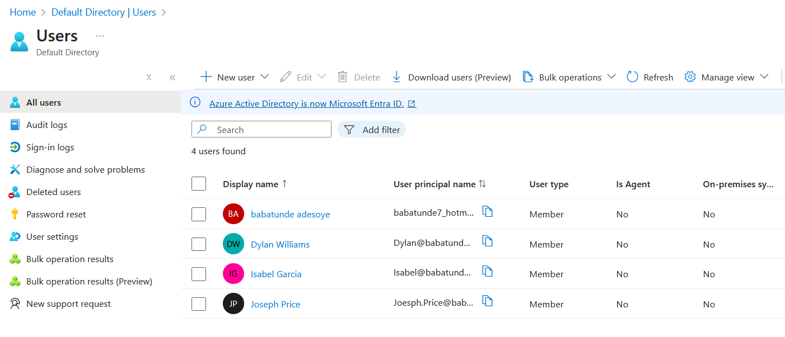
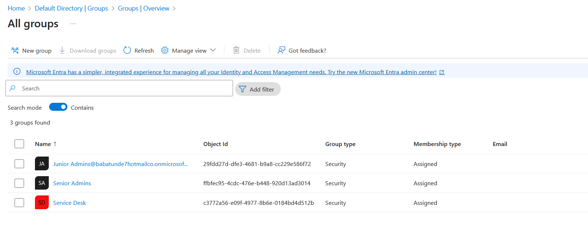
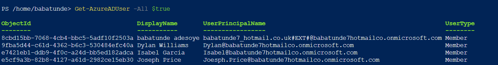
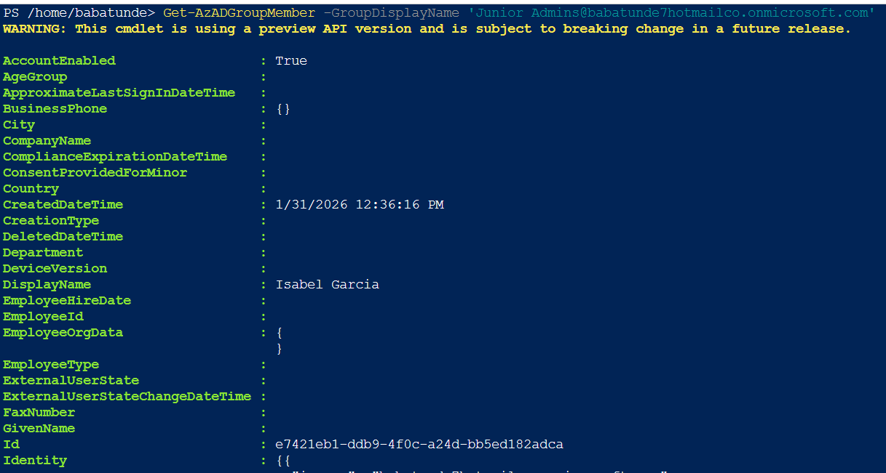
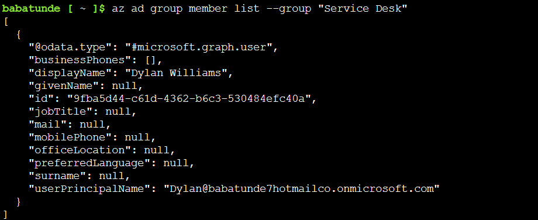
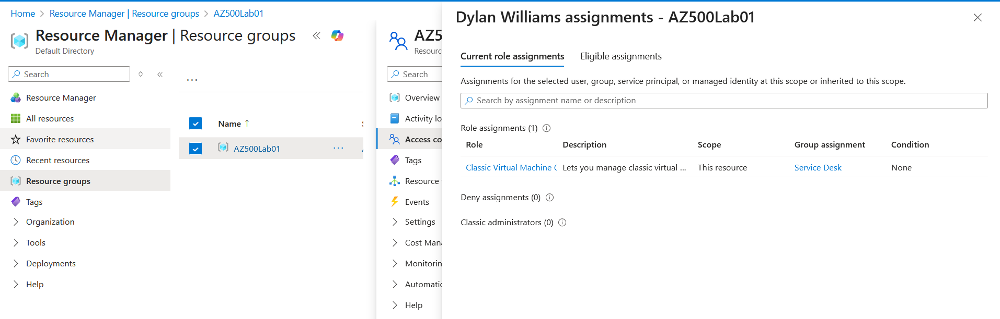
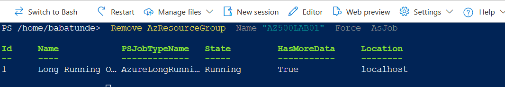

# 🛡️ Lab: Role-Based Access Control

### CCSP Domain: ☁️ D1. Cloud Concepts, Architecture & Design

- [Lab Scenario](#lab-scenario)
- [Lab Objectives](#lab-objectives)
- [RBAC Architecture Diagram](#rbac-architecture-diagram)
- [Exercise 1: Create Senior Admins Group (Azure Portal)](#exercise-1-create-senior-admins-group-azure-portal)
- [Exercise 2: Create Junior Admins Group (PowerShell)](#exercise-2-create-junior-admins-group-powershell)
- [Exercise 3: Create Service Desk Group (Azure CLI)](#exercise-3-create-service-desk-group-azure-cli)
- [Exercise 4: Assign Virtual Machine Contributor Role](#exercise-4-assign-virtual-machine-contributor-role)
- [Clean Up Resources](#clean-up-resources)


## Lab Scenario

This lab demonstrates how Azure users and groups are created and how role-based access control (RBAC) is used to assign roles to groups. The tasks include:

- Creating a **Senior Admins** group with Joseph Price as a member.
- Creating a **Junior Admins** group with Isabel Garcia as a member.
- Creating a **Service Desk** group with Dylan Williams as a member.
- Assigning the **Virtual Machine Contributor** role to the Service Desk group.

## Lab Objectives

- Exercise 1: Create the Senior Admins group with Joseph Price as a member (Azure portal).  
- Exercise 2: Create the Junior Admins group with Isabel Garcia as a member (PowerShell).  
- Exercise 3: Create the Service Desk group with Dylan Williams as a member (Azure CLI).  
- Exercise 4: Assign the Virtual Machine Contributor role to the Service Desk group.  

## RBAC Architecture Diagram


## Instructions

### Exercise 1: Create Senior Admins Group (Azure Portal)

**Estimated time: 10 minutes**

**Steps:**

1. Create a user account for **Joseph Price** in Microsoft Entra ID.
   - User name: `Joseph`
   - Name: `Joseph Price`
   - Auto-generate password.

2. Create a **Senior Admins** security group.
   - Add Joseph Price as **owner** and **member**.







### Exercise 2: Create Junior Admins Group (PowerShell)

**Estimated time: 10 minutes**

**Steps:**

1. Launch Cloud Shell and select **PowerShell**.  
2. Create a password profile:
    ```powershell
    $passwordProfile = New-Object -TypeName Microsoft.Open.AzureAD.Model.PasswordProfile
    $passwordProfile.Password = "Pa55w.rd1234"
    ```
3. Connect to Microsoft Entra ID:
    ```powershell
    Connect-AzureAD
    ```
4. Create user **Isabel Garcia**:
    ```powershell
    New-AzureADUser -DisplayName 'Isabel Garcia' -PasswordProfile $passwordProfile -UserPrincipalName "Isabel@$domainName" -AccountEnabled $true -MailNickName 'Isabel'
    ```
5. Create **Junior Admins** group and add Isabel as a member:
    ```powershell
    New-AzureADGroup -DisplayName 'Junior Admins' -MailEnabled $false -SecurityEnabled $true -MailNickName 'JuniorAdmins'
    $user = Get-AzureADUser -Filter "UserPrincipalName eq 'Isabel@$domainName'"
    Add-AzADGroupMember -MemberUserPrincipalName $user.UserPrincipalName -TargetGroupDisplayName "Junior Admins"
    ```







### Exercise 3: Create Service Desk Group (Azure CLI)

**Estimated time: 10 minutes**

**Steps:**

1. Switch to **Bash** in Cloud Shell.  
2. Identify tenant domain:
    ```bash
    DOMAINNAME=$(az ad signed-in-user show --query 'userPrincipalName' | cut -d '@' -f 2 | sed 's/\"//')
    ```
3. Create user **Dylan Williams**:
    ```bash
    az ad user create --display-name "Dylan Williams" --password "Pa55w.rd1234" --user-principal-name Dylan@$DOMAINNAME
    ```
4. Create **Service Desk** group and add Dylan as a member:
    ```bash
    az ad group create --display-name "Service Desk" --mail-nickname "ServiceDesk"
    USER=$(az ad user list --filter "displayname eq 'Dylan Williams'")
    OBJECTID=$(echo $USER | jq '.[].id' | tr -d '"')
    az ad group member add --group "Service Desk" --member-id $OBJECTID
    ```




### Exercise 4: Assign Virtual Machine Contributor Role

**Estimated time: 10 minutes**

**Steps:**

1. Create a resource group **AZ500Lab01** in the Azure portal.
2. Assign the **Virtual Machine Contributor** role to the **Service Desk** group:
   - Access control (IAM) → Add role assignment → Select role & group → Review + assign.
3. Verify access for Dylan Williams and Joseph Price under **Check Access**.




### Clean Up Resources

Remove the resource group when no longer needed:
```powershell
Remove-AzResourceGroup -Name "AZ500LAB01" -Force -AsJob
```



