# 🌐 Lab: Network Security Groups and Application Security Groups

### CCSP Domain: 
#### ☁️ D1. Cloud Concepts, Architecture & Design
#### 🖥️ D3. Cloud Platform & Infrastructure Security

---
* [Lab Scenario](#lab-scenario)
* [Lab Objectives](#lab-objectives)
* [Network & ASG Architecture Diagram](#network--asg-architecture-diagram)
* [Exercise 1: Create Virtual Networking Infrastructure](#exercise-1-create-virtual-networking-infrastructure)
* [Exercise 2: Deploy Virtual Machines and Test Network Filters](#exercise-2-deploy-virtual-machines-and-test-network-filters)
* [Clean Up Resources](#clean-up-resources)
* [Lesson Learnt and Improvement](#lesson-learnt-and-improvement)

---

## Lab Scenario

You have been asked to implement your organization’s **virtual networking infrastructure** and validate that it is functioning securely and correctly.

The environment includes:

* Two groups of servers:

  * **Web Servers**
  * **Management Servers**
* Each server group must be placed into its own **Application Security Group (ASG)**.
* You must:

  * Allow **RDP (3389)** access only to Management Servers.
  * Allow **HTTP/HTTPS (80/443)** access to Web Servers from the internet.
  * Use **Network Security Group (NSG) rules** to control traffic.
* All resources must be deployed in the **(US) West 3** region.

---

## Lab Objectives

* **Exercise 1:** Create the virtual network, NSG, and ASGs.
* **Exercise 2:** Deploy virtual machines and validate traffic filtering.

---

## Network & ASG Architecture Diagram

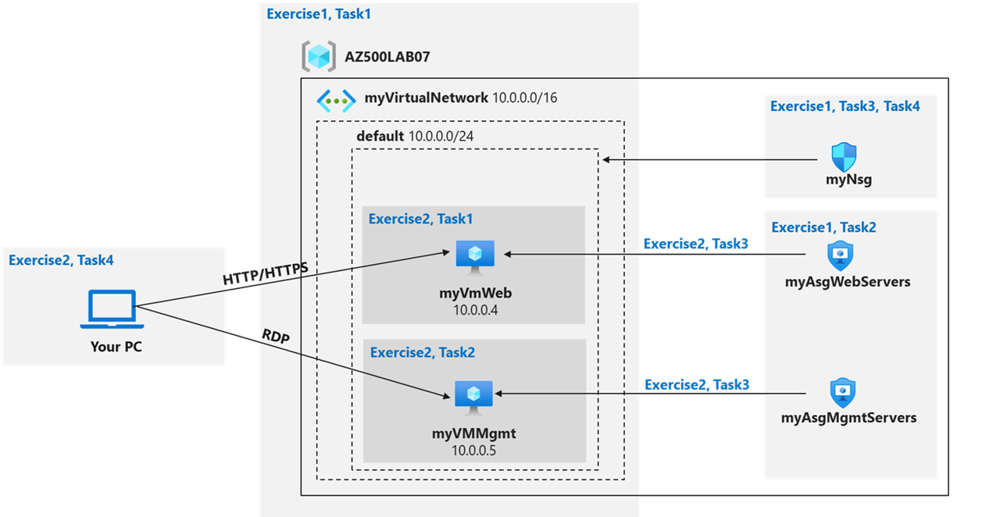

---

# Instructions

---

# Exercise 1: Create Virtual Networking Infrastructure

**Estimated time: 20 minutes**

In this exercise, you will:

* Create a virtual network and subnet
* Create two Application Security Groups
* Create a Network Security Group
* Configure inbound security rules

---

## Task 1: Create a Virtual Network

1. Sign in to the Azure portal:
   [https://portal.azure.com](https://portal.azure.com)

2. Search for **Virtual networks** → Select **+ Create**.

3. Configure the **Basics** tab:

| Setting        | Value                   |
| -------------- | ----------------------- |
| Subscription   | Your Azure subscription |
| Resource group | AZ500LAB07              |
| Name           | `myVirtualNetwork`      |
| Region         | (US) West 3             |

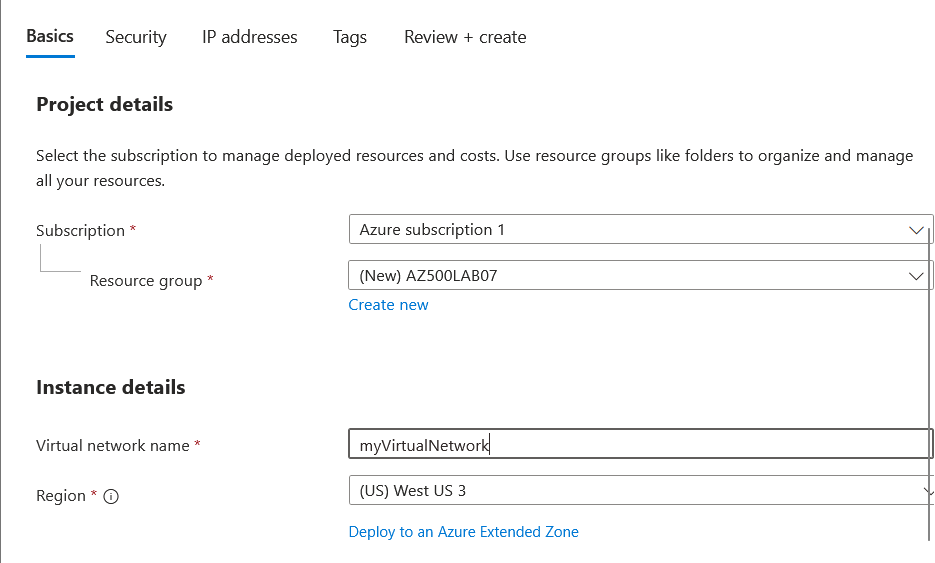


4. Configure **IP Addresses**:

   * IPv4 address space: `10.0.0.0/16`
   * Subnet name: `default`
   * Subnet address range: `10.0.0.0/24`

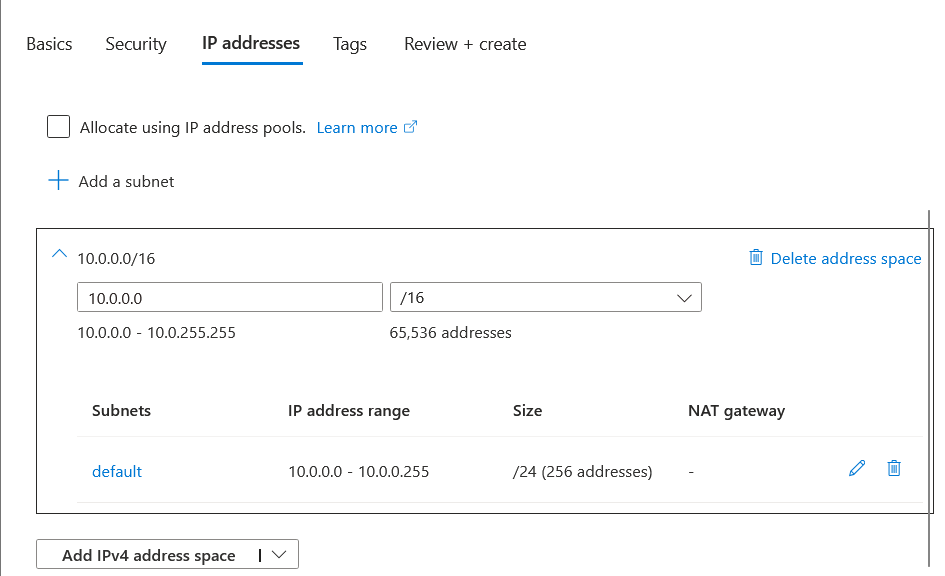

5. Click **Review + Create** → **Create**

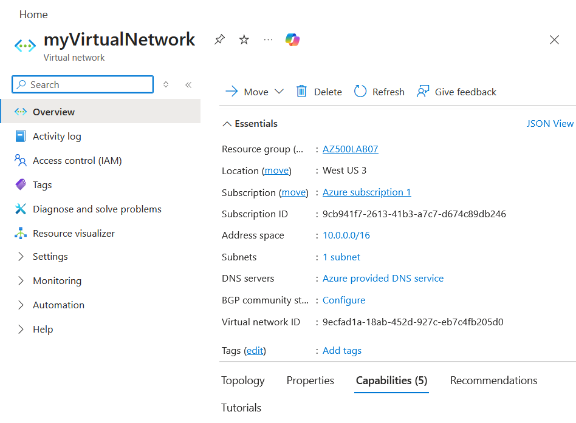


---

## Task 2: Create Application Security Groups

### Create Web Server ASG

1. Search for **Application security groups** → **+ Create**
2. Configure:

| Setting        | Value             |
| -------------- | ----------------- |
| Resource group | AZ500LAB07        |
| Name           | `myAsgWebServers` |
| Region         | (US) West 3       |


3. Click **Review + create** → **Create**

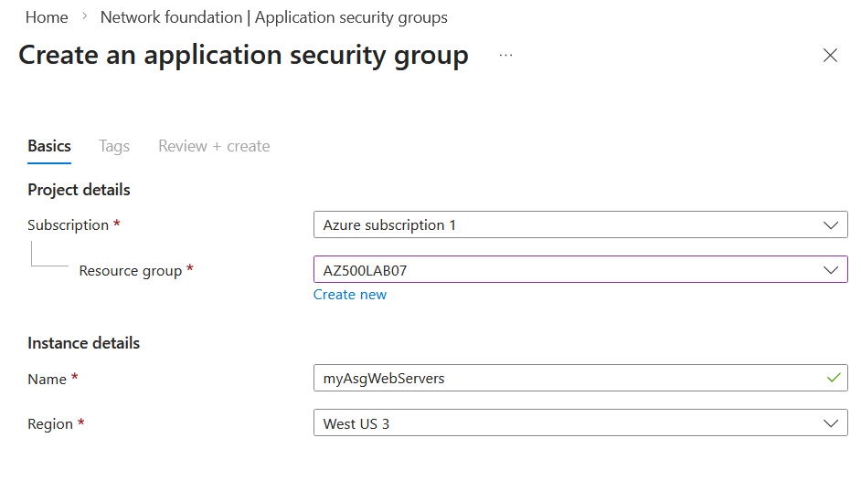

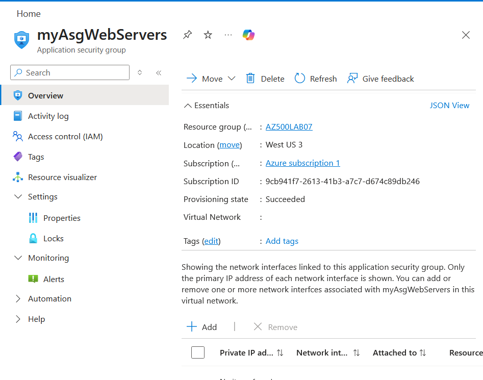

---

### Create Management Server ASG

Repeat the steps above using:

| Setting        | Value              |
| -------------- | ------------------ |
| Resource group | AZ500LAB07         |
| Name           | `myAsgMgmtServers` |
| Region         | (US) West 3           |


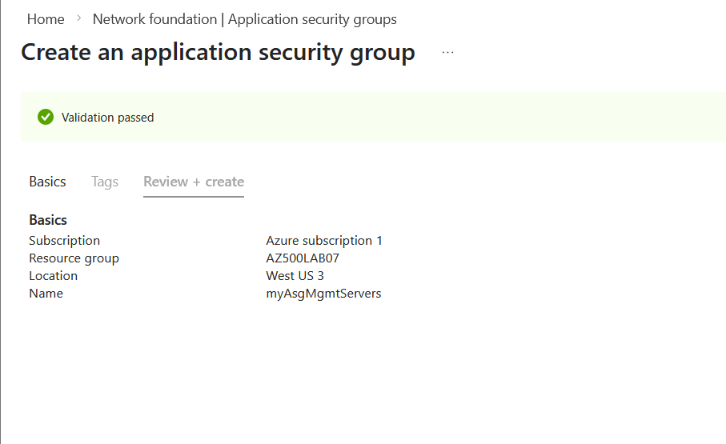

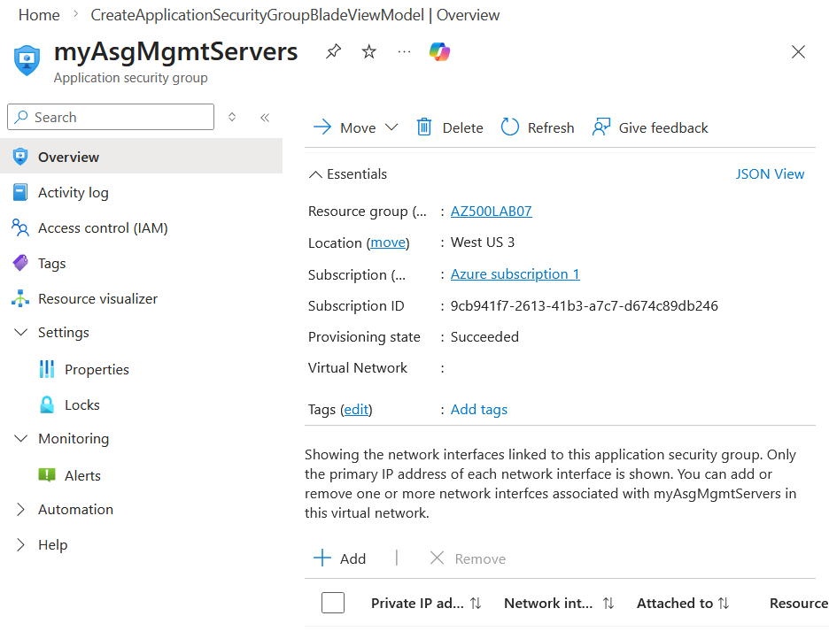

---

## Task 3: Create and Associate a Network Security Group

1. Search for **Network security groups** → **+ Create**
2. Configure:

| Setting        | Value             |
| -------------- | ----------------- |
| Subscription   | Your subscription |
| Resource group | AZ500LAB07        |
| Name           | `myNsg`           |
| Region         | (US) West 3          |

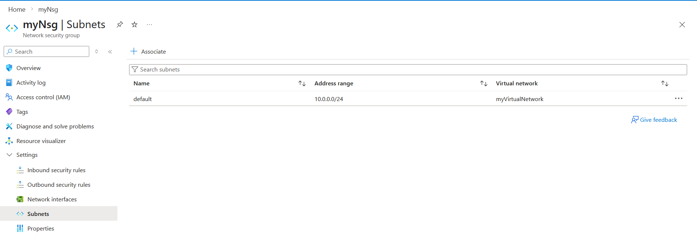


3. After deployment, open **myNsg**
4. Select **Subnets** → **+ Associate**
5. Configure:

| Setting         | Value              |
| --------------- | ------------------ |
| Virtual network | `myVirtualNetwork` |
| Subnet          | `default`          |

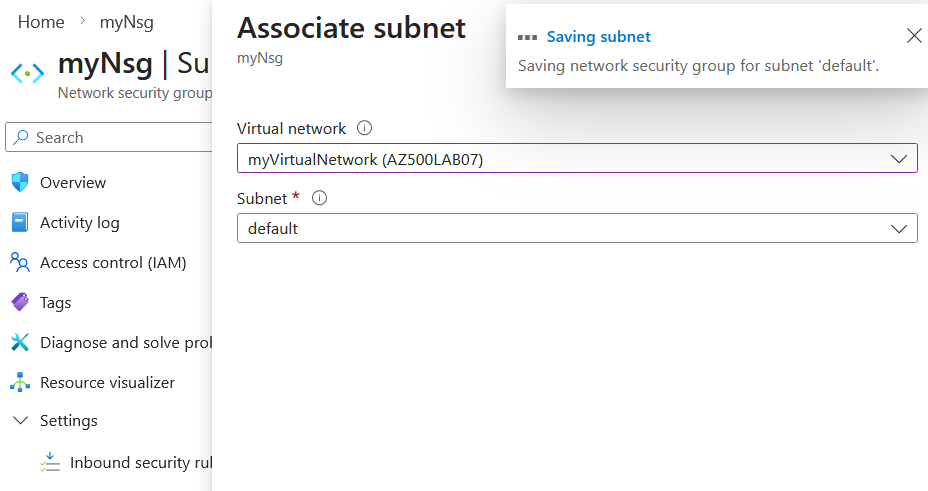

6. Click **OK**


---

## Task 4: Configure Inbound Security Rules

### Rule 1: Allow Web Traffic (HTTP/HTTPS)

1. Open **myNsg** → **Inbound security rules** → **+ Add**
2. Configure:

| Setting                 | Value                                          |
| ----------------------- | ---------------------------------------------- |
| Source                  | Any                                            |
| Destination             | Application security group → `myAsgWebServers` |
| Service                 | Custom                                         |
| Destination port ranges | `80,443`                                       |
| Protocol                | TCP                                            |
| Action                  | Allow                                          |
| Priority                | 100                                            |
| Name                    | `Allow-Web-All`                                |

Click **Add**

---

### Rule 2: Allow RDP to Management Servers

1. Click **+ Add** again
2. Configure:

| Setting                 | Value                                           |
| ----------------------- | ----------------------------------------------- |
| Source                  | Any                                             |
| Destination             | Application security group → `myAsgMgmtServers` |
| Service                 | Custom                                          |
| Destination port ranges | `3389`                                          |
| Protocol                | TCP                                             |
| Action                  | Allow                                           |
| Priority                | 110                                             |
| Name                    | `Allow-RDP-All`                                 |

Click **Add**


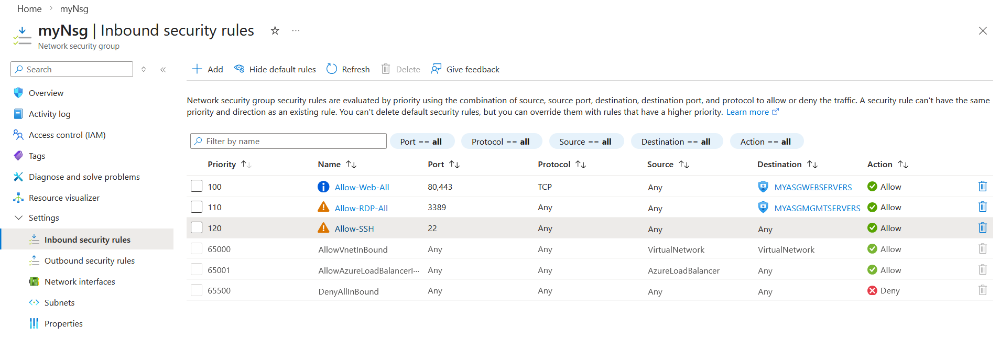

---

**Result:**
You have deployed a virtual network, NSG with inbound rules, and two ASGs.

---

# Exercise 2: Deploy Virtual Machines and Test Network Filters

**Estimated time: 25 minutes**

In this exercise, you will:

* Deploy a Web Server VM
* Deploy a Management Server VM
* Associate NICs to ASGs
* Validate traffic filtering

---

## Task 1: Create Web Server VM

1. Search **Virtual machines** → **+ Create → Virtual machine**
2. Configure:

| Setting | Value |
|----------|--------|
| Subscription | Your lab subscription |
| Resource group | AZ500LAB07 |
| Virtual machine name | myVmWeb |
| Region | (US) East US |
| Availability options | No infrastructure redundancy required |
| Security type | Standard |
| Image | Ubuntu Server 22.04 LTS |
| Size | Standard_B2as_v2 - 2 vcpus, 8 GiB memory |
| Authentication type | Password (or SSH key) |
| Username | student |
| Password | Your choice |
| Public inbound ports | None |


3. Networking:

   * Virtual network: `myVirtualNetwork`
   * Subnet: `default`
   * NIC NSG: None

4. Review + Create → Create


---

## Task 2: Create Management Server VM

Repeat VM creation with:

| Setting                        | Value      |
| ------------------------------ | ---------- |
| VM Name                        | `myVMMgmt` |
| Same region, size, credentials |            |
| Public inbound ports           | None       |

Wait for both VMs to finish deploying.

---

## Task 3: Associate NICs to Application Security Groups

### Associate Web VM

1. Open **myVM**
2. Networking → **Application security groups**
3. Add → Select `myAsgWebServers`
4. Save

---

### Associate Management VM

1. Open **myVMMgmt**
2. Networking → **Application security groups**
3. Add → Select `myAsgMgmtServers`
4. Save

---

### Task 4: Install Web Server

1. Open **myVM**
2. Head to the **Connect** blade and select **SSH**
3. Entered username and password, created eariler
```bash
sudo apt update
sudo apt install -y apache2
sudo systemctl enable apache2
sudo systemctl start apache2
sudo systemctl status apache2
```

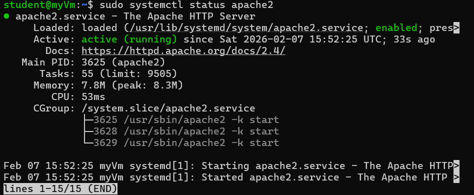


---

### Test Web Access

1. Copy the **Public IP** of `myVMWeb`
2. Open a browser and navigate to:

```
https://<PublicIP>
```

You should see the default **Apache welcome page**.


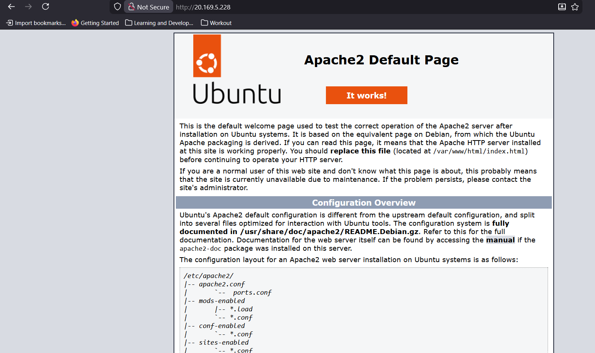

---

**Result:**
You have validated that:

* NSG rules are working
* ASGs are properly segmenting traffic
* Web traffic is allowed only to Web Servers
* RDP is restricted to Management Servers

---

# Clean Up Resources

To avoid unexpected charges, remove the resource group:

```powershell
Remove-AzResourceGroup -Name "AZ500LAB07" -Force -AsJob
```

Confirm the deletion in the Azure portal.

---

## Lesson Learnt and Improvement

🔐 SSH keys over passwords: Realized SSH key authentication is far more secure and should be my default for Linux VMs going forward.

🧪 Always test access after configuration: Setting NSG and firewall rules isn’t enough — validating connectivity ensures everything works as intended.

🧩 Use ASGs for better scalability: Assigning NICs to Application Security Groups is cleaner and more scalable than managing rules per NIC. It makes the environment easier to manage as it grows.

| Feature | NSG                               | ASG                            |
| ------- | --------------------------------- | ------------------------------ |
| Purpose | Controls traffic (security rules) | Groups VMs by role/application |
| Active? | Yes, enforces rules               | No, just a reference for NSG   |
| Scope   | Subnet or NIC                     | VM only                        |
| Analogy | Traffic policeman                 | Team tag on buildings          |
