# 🔥 Lab: Azure Firewall Deployment and Traffic Control

### CCSP Domain: 
#### ☁️ D1. Cloud Concepts, Architecture & Design
#### 🖥️ D3. Cloud Platform & Infrastructure Security

---

* [Lab Scenario](#lab-scenario)
* [Lab Objectives](#lab-objectives)
* [Azure Firewall Architecture Diagram](#azure-firewall-architecture-diagram)
* [Exercise 1: Deploy and Test Azure Firewall](#exercise-1-deploy-and-test-azure-firewall)
* [Exercise 2: Test Azure Firewall](#exercise-2-test-azure-firewall)
* [Clean Up Resources](#clean-up-resources)
* [Lesson Learnt and Improvement](#lesson-learnt-and-improvement)

---

## Lab Scenario

You have been asked to deploy **Azure Firewall** to strengthen your organization’s outbound and inbound traffic control strategy.

The environment must include:

* A **Virtual Network** with:

  * A **Workload subnet**
  * A **Jump host subnet**
* A **Virtual Machine** in each subnet
* A **User Defined Route (UDR)** forcing all outbound workload traffic through the firewall
* **Application Rules** allowing outbound traffic only to `www.bing.com`
* **Network Rules** allowing outbound DNS lookups to external DNS servers

All resources in this lab must be deployed in the **(US) West 3** region.

---

## Lab Objectives

In this lab, you will:

**Exercise 1:**
Deploy, configure, and validate Azure Firewall traffic filtering.

---

## Azure Firewall Architecture Diagram


### Traffic Flow Logic:

#### Srv-Work:
1. Workload subnet traffic → Routed to Firewall
2. Firewall evaluates:
   * Application rule → Allow `www.bing.com`
   * Network rule → Allow DNS (UDP 53)
   * Default → Deny everything else

#### Srv-Jump:
1. Internet to Srv-Jump via public IP
2. Srv-Jump to Srv-Work via private IP

---

# Instructions

---

# Exercise 1: Deploy and Test Azure Firewall

**Estimated Time: 40 minutes**

---

## Task 1: Deploy the Lab Environment Using ARM Template

You will deploy the base infrastructure using an ARM template.

1. Sign in to the Azure portal:
   [https://portal.azure.com](https://portal.azure.com)

2. Search for **Deploy a custom template** → Select **Build your own template in the editor**

3. Click **Load file**
   Load:

```json
{
    "$schema": "https://schema.management.azure.com/schemas/2019-04-01/deploymentTemplate.json#",
    "contentVersion": "1.0.0.0",
    "parameters": {
        "adminUsername": {
            "type": "string",
            "defaultValue": "localadmin"
        },
        "adminPassword": {
            "type": "secureString"
        }
    },
    "resources": [
        {
            "type": "Microsoft.Network/virtualNetworks",
            "apiVersion": "2021-05-01",
            "name": "Test-FW-VN",
            "location": "westus3",
            "properties": {
                "addressSpace": {
                    "addressPrefixes": [
                        "10.0.0.0/16"
                    ]
                },
                "subnets": [
                    {
                        "name": "AzureFirewallSubnet",
                        "properties": {
                            "addressPrefix": "10.0.1.0/26"
                        }
                    },
                    {
                        "name": "Workload-SN",
                        "properties": {
                            "addressPrefix": "10.0.2.0/24"
                        }
                    },
                    {
                        "name": "Jump-SN",
                        "properties": {
                            "addressPrefix": "10.0.3.0/24"
                        }
                    }
                ]
            }
        },
        {
            "type": "Microsoft.Network/networkSecurityGroups",
            "apiVersion": "2021-05-01",
            "name": "Srv-Jump-nsg",
            "location": "westus3",
            "properties": {
                "securityRules": [
                    {
                        "name": "Allow-SSH",
                        "properties": {
                            "protocol": "Tcp",
                            "sourcePortRange": "*",
                            "destinationPortRange": "22",
                            "sourceAddressPrefix": "*",
                            "destinationAddressPrefix": "*",
                            "access": "Allow",
                            "priority": 100,
                            "direction": "Inbound"
                        }
                    }
                ]
            }
        },
        {
            "type": "Microsoft.Network/networkSecurityGroups",
            "apiVersion": "2021-05-01",
            "name": "Srv-Work-nsg",
            "location": "westus3",
            "properties": {}
        },
        {
            "type": "Microsoft.Network/publicIPAddresses",
            "apiVersion": "2021-05-01",
            "name": "TEST-FW-PIP",
            "location": "westus3",
            "sku": {
                "name": "Standard"
            },
            "properties": {
                "publicIPAllocationMethod": "Static"
            }
        },
        {
            "type": "Microsoft.Network/networkInterfaces",
            "apiVersion": "2021-05-01",
            "name": "srv-jump121",
            "location": "westus3",
            "dependsOn": [
                "Microsoft.Network/virtualNetworks/Test-FW-VN",
                "Microsoft.Network/networkSecurityGroups/Srv-Jump-nsg"
            ],
            "properties": {
                "ipConfigurations": [
                    {
                        "name": "ipconfig1",
                        "properties": {
                            "subnet": {
                                "id": "[resourceId('Microsoft.Network/virtualNetworks/subnets','Test-FW-VN','Jump-SN')]"
                            },
                            "privateIPAllocationMethod": "Dynamic"
                        }
                    }
                ],
                "networkSecurityGroup": {
                    "id": "[resourceId('Microsoft.Network/networkSecurityGroups','Srv-Jump-nsg')]"
                }
            }
        },
        {
            "type": "Microsoft.Network/networkInterfaces",
            "apiVersion": "2021-05-01",
            "name": "srv-work267",
            "location": "westus3",
            "dependsOn": [
                "Microsoft.Network/virtualNetworks/Test-FW-VN",
                "Microsoft.Network/networkSecurityGroups/Srv-Work-nsg"
            ],
            "properties": {
                "ipConfigurations": [
                    {
                        "name": "ipconfig1",
                        "properties": {
                            "subnet": {
                                "id": "[resourceId('Microsoft.Network/virtualNetworks/subnets','Test-FW-VN','Workload-SN')]"
                            },
                            "privateIPAllocationMethod": "Dynamic"
                        }
                    }
                ],
                "networkSecurityGroup": {
                    "id": "[resourceId('Microsoft.Network/networkSecurityGroups','Srv-Work-nsg')]"
                }
            }
        },
        {
            "type": "Microsoft.Compute/virtualMachines",
            "apiVersion": "2022-08-01",
            "name": "Srv-Jump",
            "location": "westus3",
            "dependsOn": [
                "Microsoft.Network/networkInterfaces/srv-jump121"
            ],
            "properties": {
                "hardwareProfile": {
                    "vmSize": "Standard_B2as_v2"
                },
                "storageProfile": {
                    "imageReference": {
                        "publisher": "Canonical",
                        "offer": "0001-com-ubuntu-server-jammy",
                        "sku": "22_04-lts",
                        "version": "latest"
                    },
                    "osDisk": {
                        "createOption": "FromImage",
                        "managedDisk": {
                            "storageAccountType": "Premium_LRS"
                        }
                    }
                },
                "osProfile": {
                    "computerName": "Srv-Jump",
                    "adminUsername": "[parameters('adminUsername')]",
                    "adminPassword": "[parameters('adminPassword')]",
                    "linuxConfiguration": {
                        "disablePasswordAuthentication": false
                    }
                },
                "networkProfile": {
                    "networkInterfaces": [
                        {
                            "id": "[resourceId('Microsoft.Network/networkInterfaces','srv-jump121')]"
                        }
                    ]
                }
            }
        },
        {
            "type": "Microsoft.Compute/virtualMachines",
            "apiVersion": "2022-08-01",
            "name": "Srv-Work",
            "location": "westus3",
            "dependsOn": [
                "Microsoft.Network/networkInterfaces/srv-work267"
            ],
            "properties": {
                "hardwareProfile": {
                    "vmSize": "Standard_B2as_v2"
                },
                "storageProfile": {
                    "imageReference": {
                        "publisher": "Canonical",
                        "offer": "0001-com-ubuntu-server-jammy",
                        "sku": "22_04-lts",
                        "version": "latest"
                    },
                    "osDisk": {
                        "createOption": "FromImage",
                        "managedDisk": {
                            "storageAccountType": "Premium_LRS"
                        }
                    }
                },
                "osProfile": {
                    "computerName": "Srv-Work",
                    "adminUsername": "[parameters('adminUsername')]",
                    "adminPassword": "[parameters('adminPassword')]",
                    "linuxConfiguration": {
                        "disablePasswordAuthentication": false
                    }
                },
                "networkProfile": {
                    "networkInterfaces": [
                        {
                            "id": "[resourceId('Microsoft.Network/networkInterfaces','srv-work267')]"
                        }
                    ]
                }
            }
        }
    ]
}
```

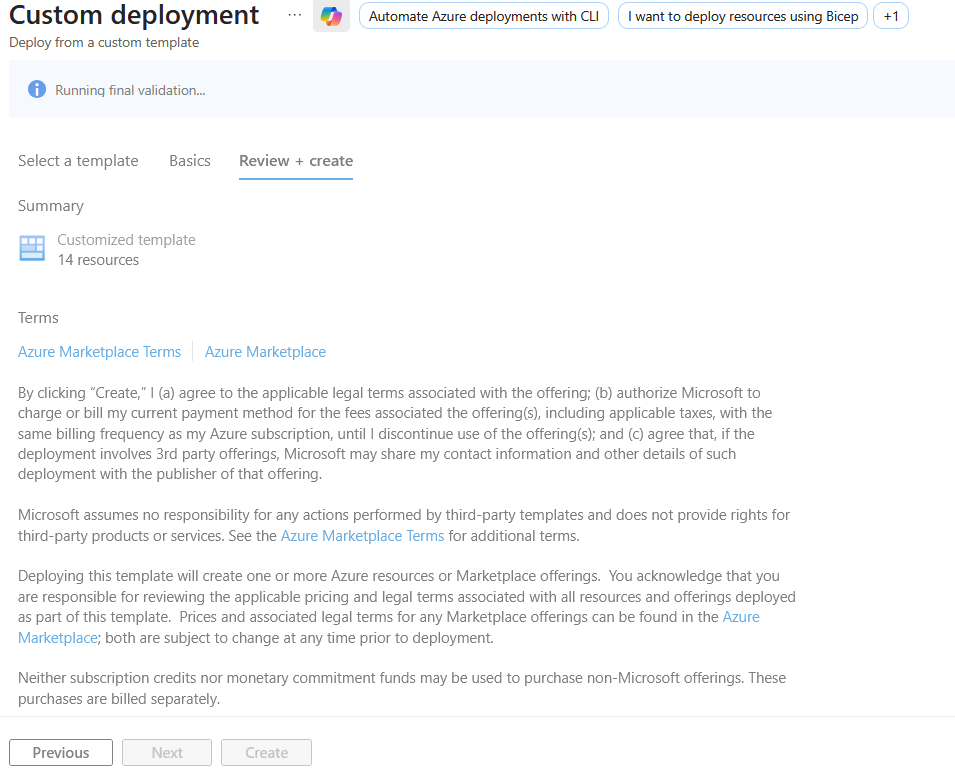


4. Click **Save**

5. Configure deployment settings:

| Setting        | Value                          |
| -------------- | ------------------------------ |
| Resource group | `AZ500LAB03` (Create new)      |
| Region         | (US) West 3                   |
| Admin Password | Secure password of your choice |

6. Click **Review + Create** → **Create**

Wait ~2 minutes for deployment.

This template deploys:

* Virtual Network: `Test-FW-VN`
* Subnets:

  * `Workload-SN`
  * `AzureFirewallSubnet`
  * `Jump-SN`
* Two Windows Server VMs:

  * `Srv-Work`
  * `Srv-Jump`


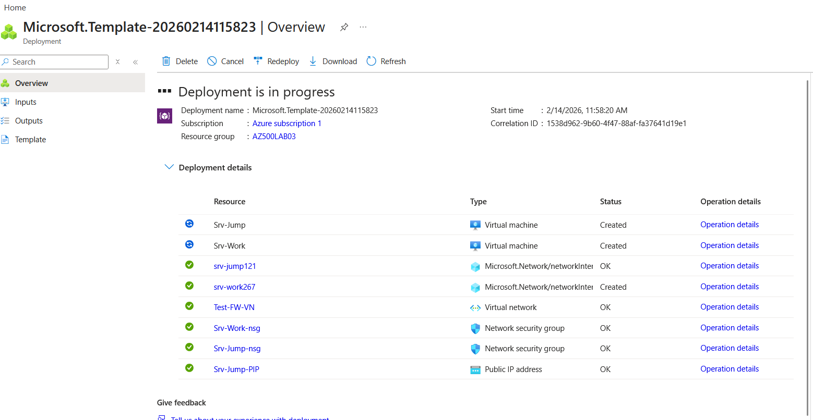
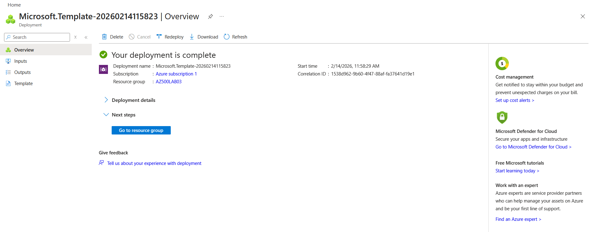


---

## Task 2: Deploy Azure Firewall

1. Search for **Firewalls** → Click **+ Create**

2. Configure:

| Setting             | Value                        |
| ------------------- | ---------------------------- |
| Resource group      | AZ500LAB03                   |
| Name                | `Test-FW01`                  |
| Region              | (US) West 3                 |
| SKU                 | Standard                     |
| Firewall management | Use Firewall rules (classic) |
| Virtual Network     | Use existing → `Test-FW-VN`  |
| Public IP           | Add new → `TEST-FW-PIP`      |

3. Click **Review + Create** → **Create**

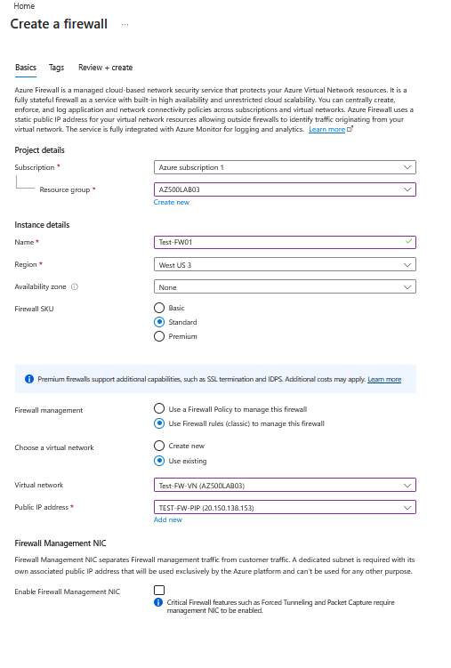


Wait ~5 minutes.

After deployment:

* Open `Test-FW01`
* Record the **Private IP Address**
  (You will use this in the route table)


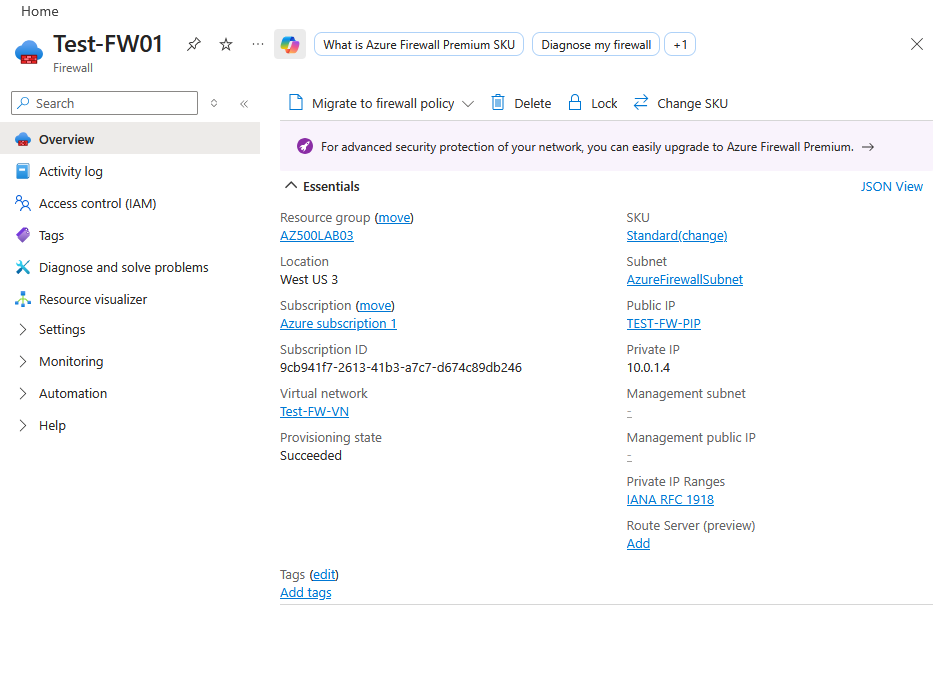


---

## Task 3: Create a Default Route (UDR)

We will force all outbound workload traffic through the firewall.

1. Search for **Route tables** → **+ Create**

| Setting        | Value            |
| -------------- | ---------------- |
| Name           | `Firewall-route` |
| Resource group | AZ500LAB03       |
| Region         | East US          |


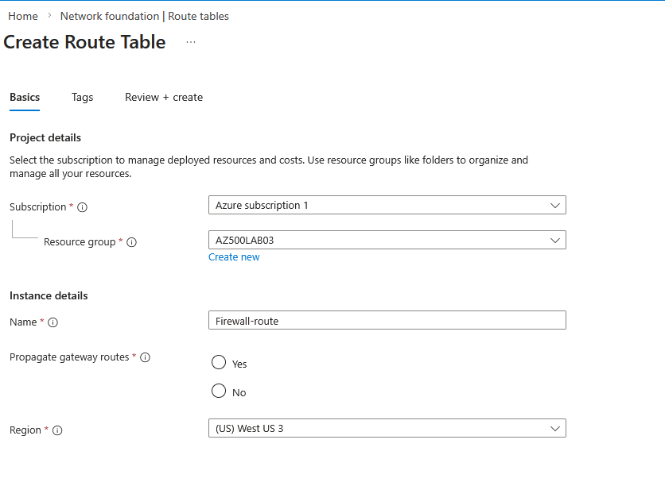

2. After deployment → Open route table
3. Go to **Subnets** → **+ Associate**

| Setting         | Value       |
| --------------- | ----------- |
| Virtual network | Test-FW-VN  |
| Subnet          | Workload-SN |


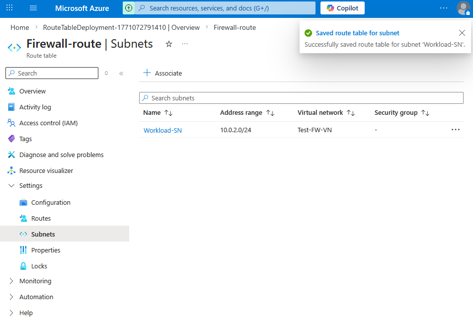

4. Go to **Routes** → **+ Add**

| Setting          | Value               |
| ---------------- | ------------------- |
| Route name       | FW-DG               |
| Destination      | 0.0.0.0/0           |
| Next hop type    | Virtual appliance   |
| Next hop address | Firewall private IP |

Click **Add**

Now all outbound traffic from `Workload-SN` must pass through Azure Firewall.


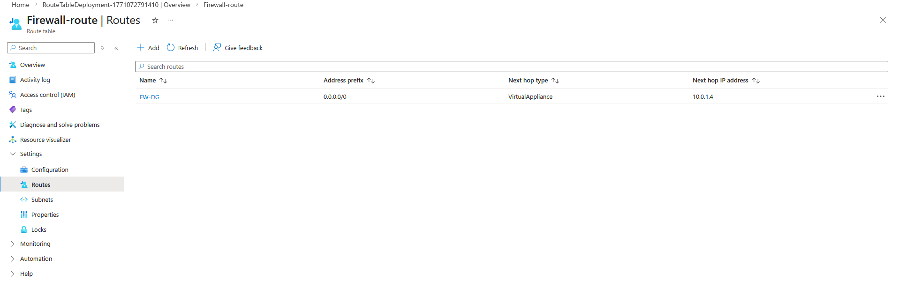

---

## Task 4: Configure Application Rule

Allow outbound traffic only to `www.bing.com`.

1. Open `Test-FW01`
2. Go to **Rules (classic)** → Application rule collection → **+ Add**

| Setting  | Value      |
| -------- | ---------- |
| Name     | App-Coll01 |
| Priority | 200        |
| Action   | Allow      |

Add rule:

| Setting     | Value                               |
| ----------- | ----------------------------------- |
| Name        | AllowBing                           |
| Source      | 10.0.2.0/24                         |
| Protocols   | HTTP:80, HTTPS:443                  |
| Target FQDN | [www.bing.com](http://www.bing.com) |

Click **Add**

Everything else will be denied by default.


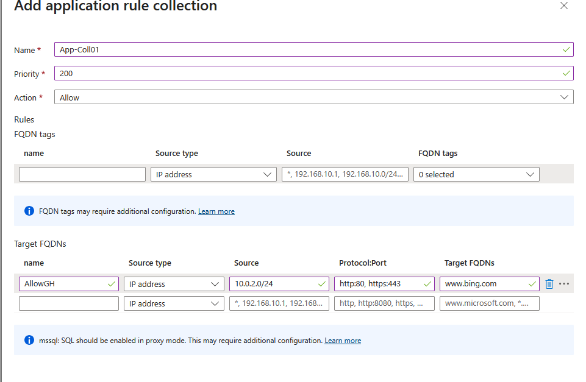


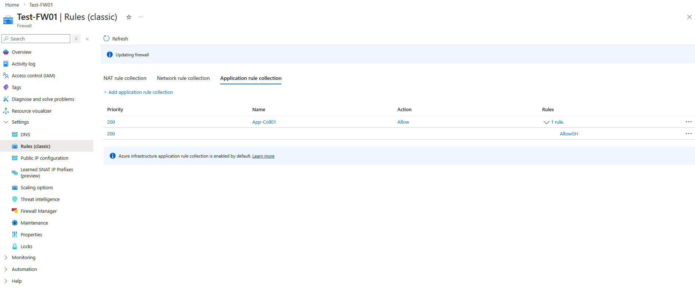

---

## Task 5: Configure Network Rule

Allow external DNS resolution.

1. Go to **Network rule collection** → **+ Add**

| Setting  | Value      |
| -------- | ---------- |
| Name     | Net-Coll01 |
| Priority | 200        |
| Action   | Allow      |

Add rule:

| Setting     | Value                    |
| ----------- | ------------------------ |
| Name        | AllowDNS                 |
| Protocol    | UDP                      |
| Source      | 10.0.2.0/24              |
| Destination | 209.244.0.3, 209.244.0.4 |
| Port        | 53                       |

These are public DNS servers.

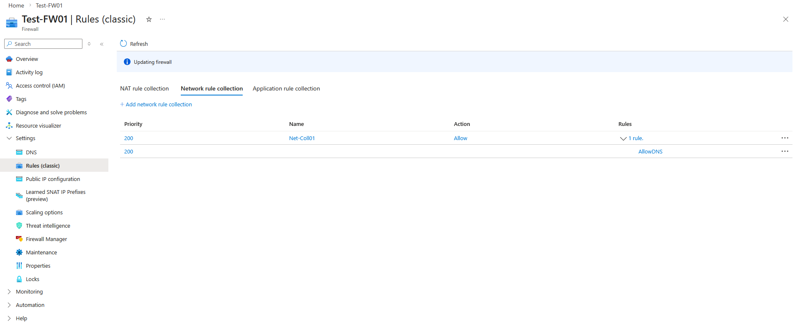


---

## Task 6: Configure VM DNS Settings

1. Open `Srv-Work` VM
2. Networking → Network Interface → **DNS servers**
3. Select **Custom**
4. Add:

```
209.244.0.3
209.244.0.4
```

Click **Save**

The VM will restart automatically.


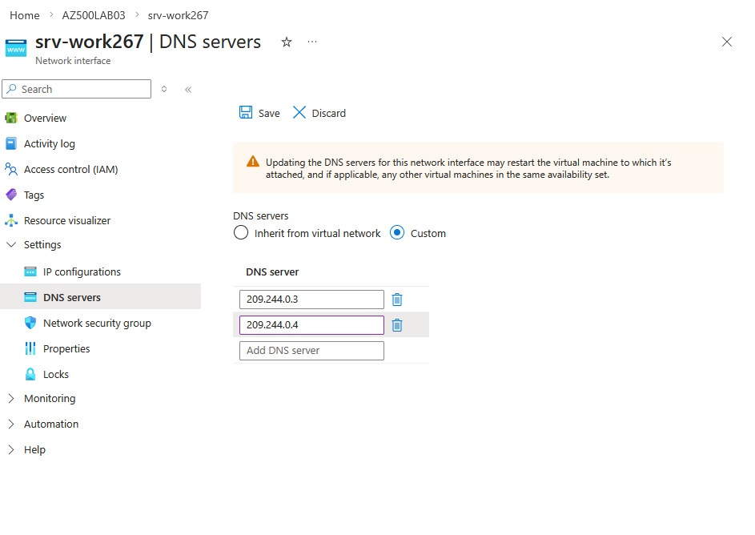
---


## Task 7: Add a Public IP Address to the Jump Server

In this task, you will assign a **Public IP address** to the **Srv-Jump** virtual machine so it can be accessed directly from the internet (for SSH or RDP testing).

You can complete this either through the **Azure Portal** or by updating your **ARM template**.

---

## Option A: Add Public IP via Azure Portal

### Step 1: Go to the Virtual Machine

1. Sign in to the Azure Portal
2. Navigate to **Virtual machines**
3. Select **Srv-Jump**

---

### Step 2: Open Network Interface Settings

1. In the VM blade, click **Networking**
2. Under **Network interface**, select the NIC (e.g., `srv-jump121`)

---

### Step 3: Associate a Public IP

1. In the NIC menu, select **IP configurations**
2. Click the configuration (usually `ipconfig1`)
3. Under **Public IP address**, click **Associate**

You can either:

* **Create new**

  * Name: `Srv-Jump-PIP`
  * Allocation: **Static** (recommended)
* **Use existing**

  * Select an already created Public IP

4. Click **Save**

The Public IP will now appear in the NIC configuration.


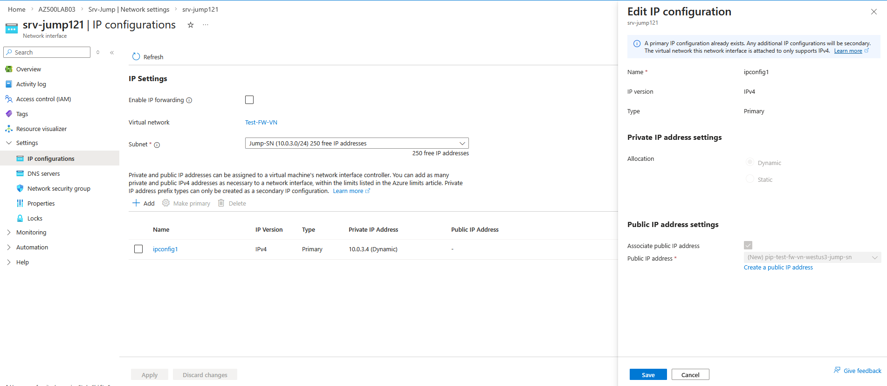


---

## Option B: Add Public IP Using ARM Template

If modifying the deployment template, perform the following steps.

---

### Step 1: Add a Public IP Resource

```json
{
  "type": "Microsoft.Network/publicIPAddresses",
  "apiVersion": "2021-05-01",
  "name": "Srv-Jump-PIP",
  "location": "westus3",
  "sku": {
    "name": "Standard"
  },
  "properties": {
    "publicIPAllocationMethod": "Static"
  }
}
```

---

### Step 2: Update the Network Interface

Modify the NIC resource to reference the new Public IP.

Add:

```json
"publicIPAddress": {
  "id": "[resourceId('Microsoft.Network/publicIPAddresses','Srv-Jump-PIP')]"
}
```

Updated NIC configuration:

```json
{
  "type": "Microsoft.Network/networkInterfaces",
  "apiVersion": "2021-05-01",
  "name": "srv-jump121",
  "location": "westus3",
  "dependsOn": [
    "Microsoft.Network/virtualNetworks/Test-FW-VN",
    "Microsoft.Network/networkSecurityGroups/Srv-Jump-nsg",
    "Microsoft.Network/publicIPAddresses/Srv-Jump-PIP"
  ],
  "properties": {
    "ipConfigurations": [
      {
        "name": "ipconfig1",
        "properties": {
          "subnet": {
            "id": "[resourceId('Microsoft.Network/virtualNetworks/subnets','Test-FW-VN','Jump-SN')]"
          },
          "privateIPAllocationMethod": "Dynamic",
          "publicIPAddress": {
            "id": "[resourceId('Microsoft.Network/publicIPAddresses','Srv-Jump-PIP')]"
          }
        }
      }
    ],
    "networkSecurityGroup": {
      "id": "[resourceId('Microsoft.Network/networkSecurityGroups','Srv-Jump-nsg')]"
    }
  }
}
```

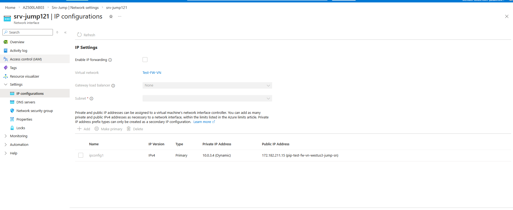


---

## Step 3: Verify Network Security Group

Ensure the NSG attached to the NIC allows inbound access.

1. Open the NIC
2. Select **Network security group**
3. Verify an inbound rule exists:

| Setting  | Value                  |
| -------- | ---------------------- |
| Protocol | TCP                    |
| Port     | 22 (SSH)               |
| Source   | Your IP or Any         |
| Action   | Allow                  |

If not present, create one.

---

## Step 4: Connect to the Jump Server

Once the Public IP is assigned, retrieve it from:

* VM Overview → **Public IP address**

Then connect:

For SSH (Linux):

```bash
ssh localadmin@<public-ip>
```

---

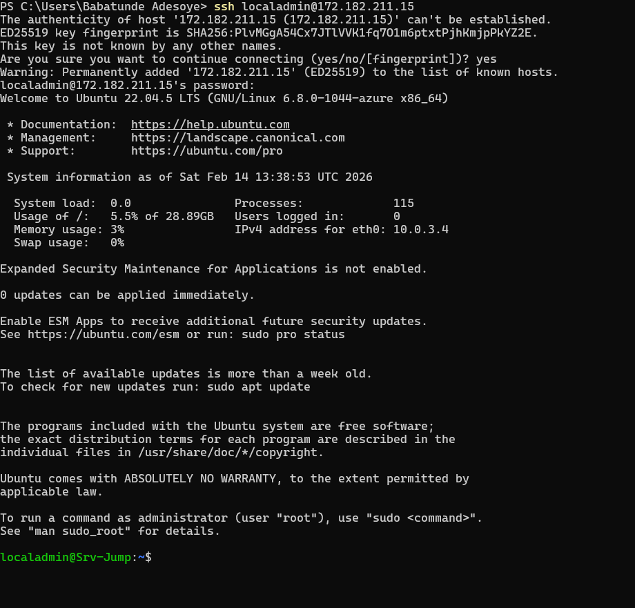


## Step 5: Connect to the Workstation

Then connect:

For SSH (Linux):

```bash
ssh localadmin@<private-address-of-srv-work>
```

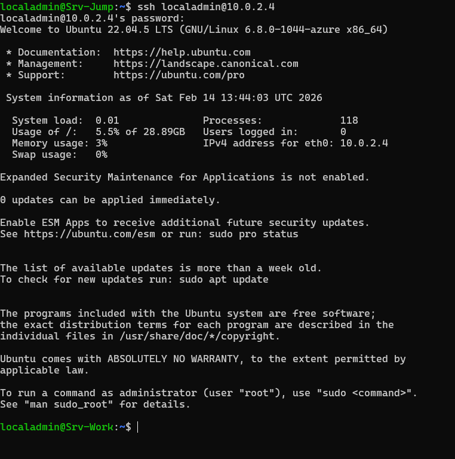


# Exercise 2: Test Azure Firewall

### Test allowed site:

```
https://www.bing.com
```

✅ Should load successfully

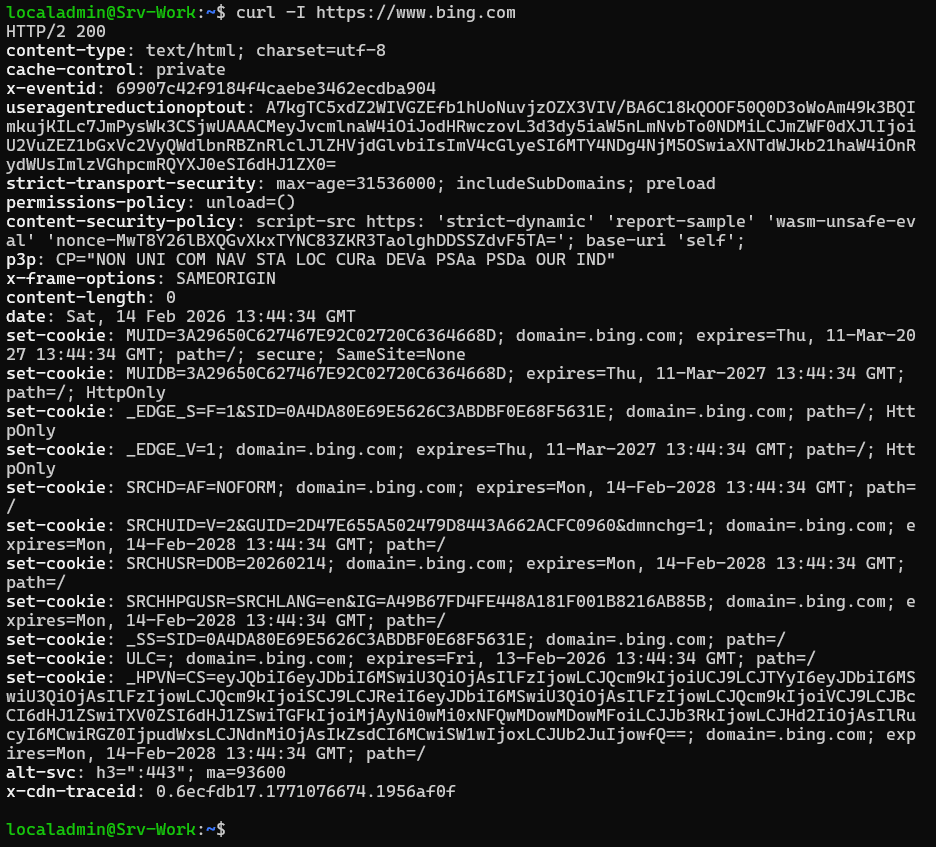


---

### Test blocked site:

```
http://www.microsoft.com
```


### Logout from Workstation and Jump Server

```bash
exit
exit
``` 
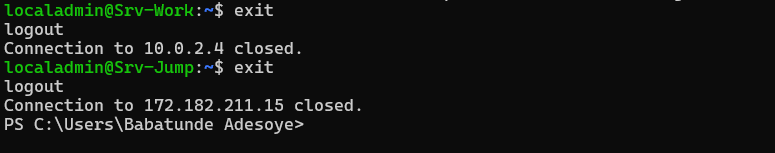

---

### Result

You have successfully:

* Forced subnet traffic through Azure Firewall
* Configured application rules
* Configured network rules
* Validated outbound filtering
* Confirmed default deny behavior

---

# Clean Up Resources

To avoid unexpected costs:

Open **Cloud Shell (PowerShell)** and run:

```powershell
Remove-AzResourceGroup -Name "AZ500LAB03" -Force -AsJob
```

Confirm deletion in the portal.


---

# Lesson Learnt and Improvement

🔥 **Azure Firewall enforces Zero Trust principles**
Only explicitly allowed traffic is permitted.

🛣️ **User Defined Routes are critical**
Without UDRs, traffic bypasses the firewall.

🌐 **Application vs Network Rules**

| Feature           | Application Rule | Network Rule                |
| ----------------- | ---------------- | --------------------------- |
| Works on          | FQDN (Layer 7)   | IP/Port (Layer 3/4)         |
| Use Case          | Web filtering    | DNS, infrastructure traffic |
| Smarter filtering | Yes              | No                          |

🧠 **Default deny is powerful**
Once traffic flows through Azure Firewall, anything not allowed is blocked automatically.
